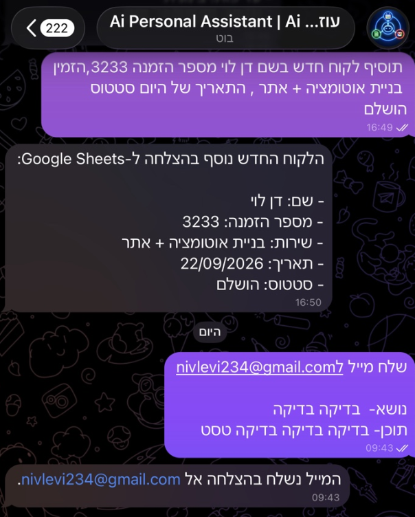
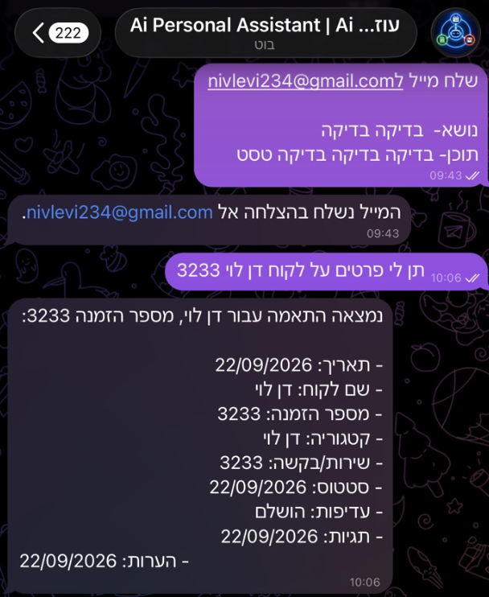

# n8n Multi-Agent Personal Assistant

A personal automation built with n8n and controlled through Telegram.

One main Manager Agent receives the user's message and sends the task to one of three specialized agents. Each agent handles a different type of work, so simple Telegram messages can be used to manage emails, calendar events, and customer records.

## What It Does

The workflow starts when a message is sent to the Telegram bot.

The Manager Agent reads the request and sends it to the correct agent.

### Email Agent

Handles Gmail actions.

It can:

- Create an email draft
- Send an email when the user asks to send it

Example:

> Send an email to daniel@example.com and tell him the meeting was moved to tomorrow.

### Calendar Agent

Handles Google Calendar actions.

It can:

- Check existing events
- Check the user's schedule
- Create new calendar events
- Understand relative dates such as today and tomorrow

Example:

> Create a meeting tomorrow at 10:00 called Project Review.

### Customers Agent

Handles customer records in Google Sheets.

It can:

- Add a new customer
- Find an existing customer
- Return customer details
- Check for an existing record before adding a new one

Example:

> Add Ron Levi, order 3333, for website and automation development.

Or:

> Show me all the details for Ron Levi.

## How It Works

```text
Telegram
   |
   v
Manager Agent
   |
   +--> Email Agent --> Gmail
   |
   +--> Calendar Agent --> Google Calendar
   |
   +--> Customers Agent --> Google Sheets
   |
   v
Telegram Reply
```

The Manager Agent is the main entry point. It does not send emails, create events, or update the customer sheet by itself. It chooses the correct specialized agent for each request.

A single message can also use more than one agent.

Example:

> Create a meeting tomorrow at 10:00 and send Daniel an email about it.

The Manager Agent sends the calendar part to the Calendar Agent and the email part to the Email Agent.

## Key Features

- Multi-agent workflow built in n8n
- Telegram as the user interface
- One Manager Agent and three specialized agents
- Gmail integration
- Google Calendar integration
- Google Sheets integration
- Customer search and duplicate checking
- Short-term conversation memory
- Natural language requests
- Relative date handling with the Asia/Jerusalem timezone

## Example Requests

```text
What do I have on my calendar tomorrow?

Create an event tomorrow at 16:00 called Project Meeting.

Draft an email to Daniel about the new proposal.

Send an email to daniel@example.com and tell him I will call tomorrow.

Add a new customer named Ron Levi, order number 3333, for website and automation development.

Show me all the details for customer Ron Levi.
```

## Tech Stack

- n8n
- OpenAI
- Telegram
- Gmail
- Google Calendar
- Google Sheets

## Workflow Structure

The workflow contains:

- Telegram Trigger
- Manager Agent
- Simple Memory
- Telegram Reply
- Email Agent
- Calendar Agent
- Customers Agent

Each specialized agent only has the tools it needs.

### Email Agent Tools

- Send Email
- Create Draft

### Calendar Agent Tools

- Get Events
- Create Event

### Customers Agent Tools

- Find Customer
- Add Customer

## Customer Data

Customer records are stored in Google Sheets with these fields:

- Date
- Customer name
- Order number
- Category
- Service / request
- Status
- Priority
- Tags
- Notes

Before a new customer is added, the Customers Agent first checks the existing sheet.

## Setup

To run the workflow, you need:

1. An n8n instance
2. An OpenAI API credential in n8n
3. A Telegram bot
4. Google credentials connected in n8n for Gmail, Google Calendar, and Google Sheets
5. A Google Sheet for customer records

Then:

1. Import `workflow/multi-agent-personal-assistant.json` into n8n
2. Connect your own credentials
3. Set your Google Sheet ID and sheet tab
4. Activate the workflow
5. Send a message to the Telegram bot

## Security

API keys, OAuth tokens, and account credentials are not included in this repository.

The workflow file uses placeholders for account-specific values such as the Google Sheet ID.

## Current Version

The current version supports text messages through Telegram.

## Repository Contents

```text
.
├── README.md
├── .gitignore
├── workflow
│   └── multi-agent-personal-assistant.json
├── examples
│   ├── customer-sheet-template.csv
│   └── example-requests.md
└── screenshots
    ├── workflow-overview.png
    ├── google-sheets-customers.png
    ├── telegram-example-1.png
    └── telegram-example-2.png
```

## Screenshots

### Workflow Overview

The Manager Agent receives the Telegram message and routes it to the correct specialized agent.


### Telegram Examples

Real examples of using the assistant through Telegram.

<table>
  <tr>
    <td width="50%"></td>
    <td width="50%"></td>
  </tr>
</table>

### Customer Records in Google Sheets

The Customers Agent reads from and adds records to this Google Sheet.


## Project Goal

The goal of this project was to build a clear multi-agent automation that saves time on simple daily tasks.

Instead of putting every action inside one agent, the workflow separates email, calendar, and customer tasks between three specialized agents, while the Manager Agent decides where each request should go.
