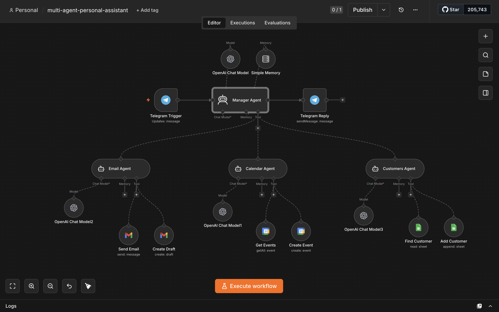
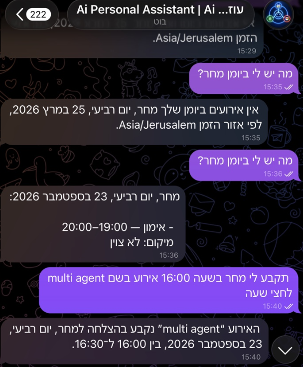
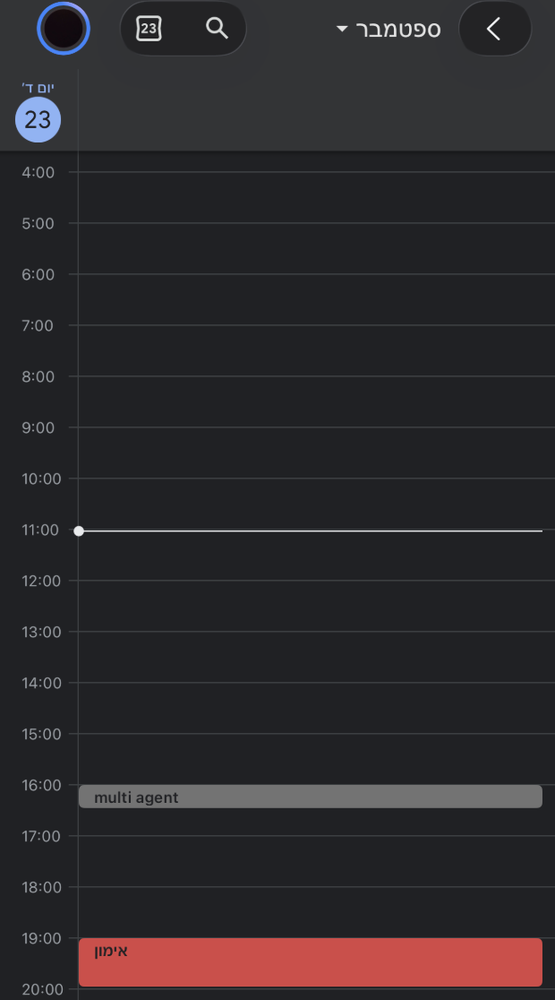
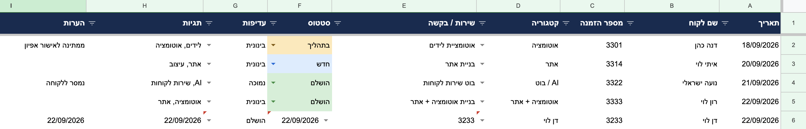

# n8n Multi-Agent Personal Assistant

A personal automation built with n8n and controlled through Telegram.

The workflow uses one Manager Agent and three specialized agents. The Manager Agent understands the user's message and sends the task to the right agent. Each agent is responsible for a different type of work.

The goal is simple: send a short Telegram message and let the automation handle the task instead of opening several apps and doing it manually.

## How It Works

```text
Telegram
   |
   v
Manager Agent
   |
   +--> Email Agent ------> Gmail
   |
   +--> Calendar Agent ---> Google Calendar
   |
   +--> Customers Agent --> Google Sheets
   |
   v
Telegram Reply
```

The Manager Agent is the main entry point. It receives the request, decides which specialized agent should handle it, waits for the result, and sends a short response back to Telegram.

## Agents

### Manager Agent

Responsible for understanding the request and routing it to the correct specialized agent.

It also handles relative dates such as today and tomorrow using the Asia/Jerusalem timezone.

### Email Agent

Connected to Gmail.

It can:

- Create email drafts
- Send emails when the user explicitly asks to send them

### Calendar Agent

Connected to Google Calendar.

It can:

- Check existing calendar events
- Check the user's schedule
- Create new calendar events

### Customers Agent

Connected to Google Sheets.

It can:

- Add a new customer
- Find an existing customer by name or order number
- Return customer information
- Check for an existing record before adding a new customer

## Example Requests

```text
What do I have on my calendar tomorrow?

Create an event tomorrow at 16:00 called Project Meeting.

Draft an email to Daniel about the new proposal.

Send an email to daniel@example.com and tell him I will call tomorrow.

Add a new customer named Ron Levi, order number 3333, for website and automation development.

Show me the details for customer Ron Levi.
```

## Integrations

- n8n
- OpenAI
- Telegram
- Gmail
- Google Calendar
- Google Sheets

## Key Features

- One Manager Agent with three specialized agents
- Natural language commands through Telegram
- Agent routing and tool calling
- Gmail actions
- Google Calendar actions
- Google Sheets customer management
- Duplicate checking before adding customer records
- Short-term conversation memory
- Relative date handling

## Workflow



The workflow keeps each area separate so every agent only receives the tools it needs.

## Calendar Example

A calendar event can be created from a simple Telegram message.

<table>
  <tr>
    <td width="50%"></td>
    <td width="50%"></td>
  </tr>
</table>

## Customer Records

Customer information is stored in Google Sheets.



The customer sheet contains:

- Date
- Customer name
- Order number
- Category
- Service or request
- Status
- Priority
- Tags
- Notes

## Project Structure

```text
.
├── README.md
├── .gitignore
├── workflow/
│   └── multi-agent-personal-assistant.json
├── examples/
│   ├── customer-sheet-template.csv
│   └── example-requests.md
└── screenshots/
    ├── workflow-overview.png
    ├── telegram-calendar-command.png
    ├── google-calendar-result.png
    └── google-sheets-customers.png
```

## Setup

To run the project:

1. Import `workflow/multi-agent-personal-assistant.json` into n8n.
2. Connect your OpenAI credential.
3. Connect a Telegram bot.
4. Connect Gmail, Google Calendar, and Google Sheets.
5. Replace the Google Sheets placeholders with your own Sheet ID and sheet tab.
6. Activate the workflow.
7. Send a message to the Telegram bot.

## Security

Credentials, API keys, OAuth tokens, and personal account IDs are not included in the repository.

The exported workflow uses placeholders for account-specific Google Sheets values.

## Current Version

The current workflow supports text messages through Telegram. Voice messages are not implemented.
